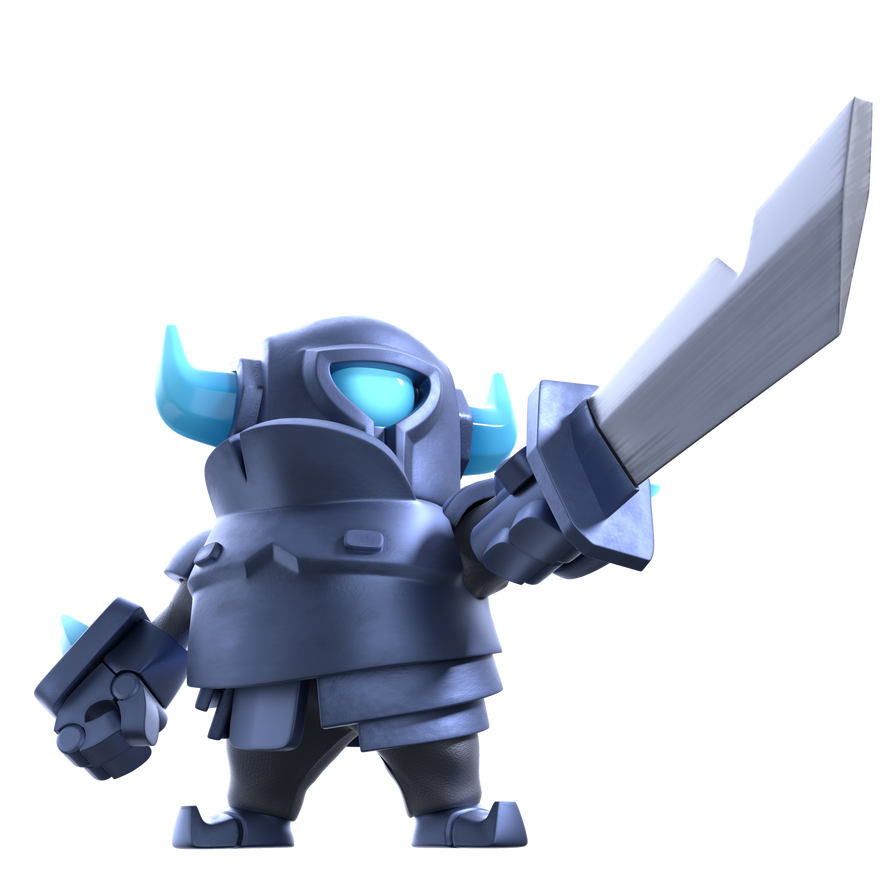
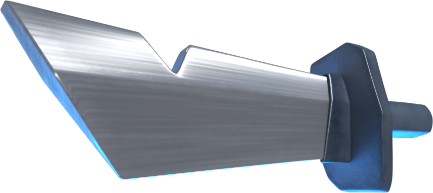
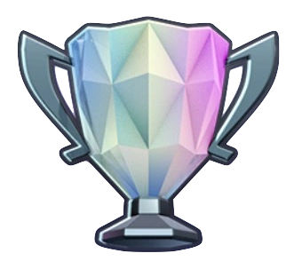
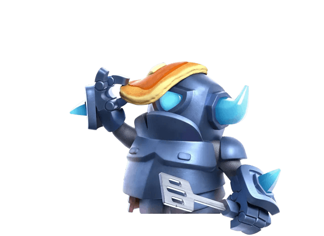

# Mini P.E.K.K.A - El Guerrero de Hierro

Este proyecto es una página web creada con **HTML y CSS** dedicada al legendario personaje **Mini P.E.K.K.A**, del universo de *Clash Royale* y *Clash of Clans*.  
Su objetivo es rendir homenaje a este guerrero metálico mediante una presentación visual elegante y temática.

## 🧠 Descripción

La página muestra una presentación informativa con imágenes e íconos relacionados con el Mini P.E.K.K.A.  
El diseño incluye colores fríos, efectos de sombra y adaptabilidad para dispositivos móviles.

## 🖼️ Vista previa de imágenes

| Imagen | Descripción |
|:--:|:--|
|  | Mini P.E.K.K.A listo para la batalla |
|  | Espada característica del Mini P.E.K.K.A |
|  | Trofeo representativo del juego |
|  | Símbolo del acero y la fuerza |

## 💻 Tecnologías utilizadas

- **HTML5**
- **CSS3 (inline y responsive)**

## 📁 Archivos requeridos

Asegúrate de colocar todos los archivos en la misma carpeta para el correcto funcionamiento:

```
codigo.html
pekka_head.png
sword.png
clash_trophy.png
steel_icon.png
fondo_pekka.jpg
```

## 🚀 Cómo ejecutar

1. Descarga todos los archivos del proyecto.  
2. Colócalos en una misma carpeta.  
3. Abre `codigo.html` con tu navegador favorito.

## ✨ Autor

Creado por **Victor Lobo**  
Inspirado en el personaje **Mini P.E.K.K.A** del universo *Clash Royale*.
